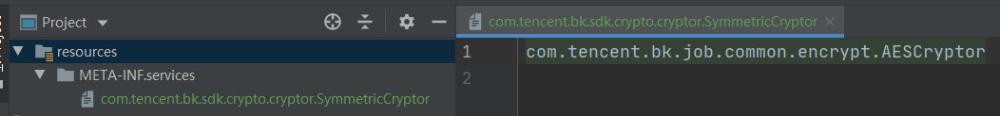
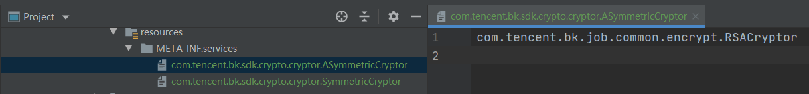

[](https://github.com/TencentBlueKing/crypto-java-sdk/blob/master/LICENSE.txt) [](https://github.com/TencentBlueKing/crypto-java-sdk/pulls)

## Overview

crypto-java-sdk是蓝鲸Java系产品使用的一套加解密算法工具包，该工具包提供统一的加解密算法接口，并基于底层国密算法库提供默认的国密算法实现，支持灵活的自定义扩展，基于蓝鲸各产品间的约定使用统一的配置与参数，屏蔽细节，便于上层业务开箱即用以及切换使用多种加解密算法。  

## Features

对称加密：
- SM4（使用国密算法SM4/CTR/NoPadding进行加解密）
- AES（使用国际算法AES/CTR/NoPadding进行加解密）
- None（用于某些不加密的场景）

非对称加密：
- SM2（使用国密算法SM2进行加解密）
- RSA（使用国际算法RSA进行加解密）

## Getting started

### Installation

### maven
```
<dependency>
  <groupId>com.tencent.bk.sdk</groupId>
  <artifactId>crypto-java-sdk</artifactId>
  <version>${version}</version>
</dependency>
```

#### gradle
```
implementation "com.tencent.bk.sdk:crypto-java-sdk:${version}"
```

### Usage

#### 1. 引入依赖包
Maven坐标：  
com.tencent.bk.sdk:crypto-java-sdk:0.0.7  


#### 2. SDK对外提供的接口
对称加密：  
com.tencent.bk.sdk.crypto.cryptor.SymmetricCryptor  
非对称加密：  
com.tencent.bk.sdk.crypto.cryptor.ASymmetricCryptor  

#### 3. 使用SDK内提供的默认实现
对称加密：  
```java
SymmetricCryptor cryptor = SymmetricCryptorFactory.getCryptor(CryptorNames.SM4);
String KEY = "12345678";
String MESSAGE = "abcdefg中文";
// 加密
String encryptedMessage = cryptor.encrypt(KEY, MESSAGE);
// 解密
String decryptedMessage = cryptor.decrypt(KEY, encryptedMessage);
```
非对称加密：  
```java
ASymmetricCryptor cryptor = ASymmetricCryptorFactory.getCryptor(CryptorNames.SM2);

KeyPair keyPair = SM2Util.genKeyPair();
String MESSAGE = "abcdefg中文";
// 加密
String encryptedMessage = cryptor.encrypt(keyPair.getPublic(), MESSAGE);
// 解密
String decryptedMessage = cryptor.decrypt(keyPair.getPrivate(), encryptedMessage);
```

#### 4. 自定义项目特有的加解密算法实现
**对称加密（以AES为例）**    
（1）编写自定义的SymmetricCryptor实现类（需要有无参数构造函数），可继承自AbstractSymmetricCryptor或实现SymmetricCryptor接口；  
（2）为实现类添加Cryptor注解，指定名称、类型与优先级（若名称不重复可不指定），示例代码如下：
```java
package com.tencent.bk.job.common.encrypt;

import com.tencent.bk.job.common.exception.CryptoException;
import com.tencent.bk.job.common.util.crypto.AESUtils;
import com.tencent.bk.sdk.crypto.annotation.Cryptor;
import com.tencent.bk.sdk.crypto.annotation.CryptorTypeEnum;
import com.tencent.bk.sdk.crypto.cryptor.AbstractSymmetricCryptor;
import org.slf4j.helpers.FormattingTuple;
import org.slf4j.helpers.MessageFormatter;

/**
 * 使用AES/CBC/PKCS5Padding的加密实现
 */
@Cryptor(name = JobCryptorNames.AES, type = CryptorTypeEnum.SYMMETRIC)
public class AESCryptor extends AbstractSymmetricCryptor {
    @Override
    public byte[] encrypt(byte[] key, byte[] message) {
        try {
            return AESUtils.encrypt(message, key);
        } catch (Exception e) {
            FormattingTuple msg = MessageFormatter.format(
                "Fail to encrypt using AES, key.len={}, message.len={}",
                key.length,
                message.length
            );
            throw new CryptoException(msg.getMessage(), e);
        }
    }

    @Override
    public byte[] decrypt(byte[] key, byte[] encryptedMessage) {
        try {
            return AESUtils.decrypt(encryptedMessage, key);
        } catch (Exception e) {
            FormattingTuple msg = MessageFormatter.format(
                "Fail to decrypt using AES, key.len={}, encryptedMessage.len={}",
                key.length,
                encryptedMessage.length
            );
            throw new CryptoException(msg.getMessage(), e);
        }
    }
}
```
（3）将实现类注册为Service提供者  
在项目资源目录resources下创建META-INF/services/com.tencent.bk.sdk.crypto.cryptor.SymmetricCryptor文件，文件中内容填写自定义实现类的全限定名（每行一个），示例效果如下图：


（4）使用自定义的加解密算法
```java
SymmetricCryptor cryptor = SymmetricCryptorFactory.getCryptor(JobCryptorNames.AES);
String KEY = "12345678";
String MESSAGE = "abcdefg中文";
// 加密
String encryptedMessage = cryptor.encrypt(KEY, MESSAGE);
// 解密
String decryptedMessage = cryptor.decrypt(KEY, encryptedMessage);
```


**非对称加密（以RSA为例）**    
（1）编写自定义的ASymmetricCryptor实现类（需要有无参数构造函数），可继承自AbstractASymmetricCryptor或实现ASymmetricCryptor接口；  
（2）为实现类添加Cryptor注解，指定名称、类型与优先级（若名称不重复可不指定），示例代码如下：
```java
package com.tencent.bk.job.common.encrypt;

import com.tencent.bk.job.common.exception.CryptoException;
import com.tencent.bk.job.common.util.crypto.RSAUtils;
import com.tencent.bk.sdk.crypto.annotation.Cryptor;
import com.tencent.bk.sdk.crypto.annotation.CryptorTypeEnum;
import com.tencent.bk.sdk.crypto.cryptor.AbstractASymmetricCryptor;
import org.slf4j.helpers.FormattingTuple;
import org.slf4j.helpers.MessageFormatter;

/**
 * 使用RSA的加密实现
 */
@Cryptor(name = JobCryptorNames.RSA, type = CryptorTypeEnum.ASYMMETRIC)
public class RSACryptor extends AbstractASymmetricCryptor {
    @Override
    public byte[] encrypt(PublicKey publicKey, byte[] message) {
        try {
            return RSAUtils.encryptToBytes(message, publicKey);
        } catch (Exception e) {
            FormattingTuple msg = MessageFormatter.format(
                "Fail to encrypt using RSA, publicKey.len={}, message.len={}",
                publicKey.getEncoded().length,
                message.length
            );
            throw new CryptoException(msg.getMessage(), e);
        }
    }

    @Override
    public byte[] decrypt(PrivateKey privateKey, byte[] encryptedMessage) {
        try {
            return RSAUtils.decryptToBytes(encryptedMessage, privateKey);
        } catch (Exception e) {
            FormattingTuple msg = MessageFormatter.format(
                "Fail to decrypt using RSA, privateKey.len={}, encryptedMessage.len={}",
                privateKey.getEncoded().length,
                encryptedMessage.length
            );
            throw new CryptoException(msg.getMessage(), e);
        }
    }
}
```
（3）将实现类注册为Service提供者  
在项目资源目录resources下创建META-INF/services/com.tencent.bk.sdk.crypto.cryptor.ASymmetricCryptor文件，文件中内容填写自定义实现类的全限定名（每行一个），示例效果如下图：


（4）使用自定义的加解密算法
```java
ASymmetricCryptor cryptor = ASymmetricCryptorFactory.getCryptor(JobCryptorNames.RSA);

PublicKey publicKey = RSAUtils.getPublicKey("xxx");
PrivateKey privateKey = RSAUtils.getPrivateKey("xxx");
String MESSAGE = "abcdefg中文";
// 加密
String encryptedMessage = cryptor.encrypt(publicKey, MESSAGE);
// 解密
String decryptedMessage = cryptor.decrypt(privateKey, encryptedMessage);
```


## Roadmap

TODO

## Support

- [蓝鲸论坛](https://bk.tencent.com/s-mart/community)
- [蓝鲸 DevOps 在线视频教程](https://bk.tencent.com/s-mart/video/)
- 联系我们，技术交流QQ群：


## BlueKing Community

- [BK-CI](https://github.com/Tencent/bk-ci)：蓝鲸持续集成平台是一个开源的持续集成和持续交付系统，可以轻松将你的研发流程呈现到你面前。
- [BK-BCS](https://github.com/Tencent/bk-bcs)：蓝鲸容器管理平台是以容器技术为基础，为微服务业务提供编排管理的基础服务平台。
- [BK-PaaS](https://github.com/Tencent/bk-PaaS)：蓝鲸PaaS平台是一个开放式的开发平台，让开发者可以方便快捷地创建、开发、部署和管理SaaS应用。
- [BK-SOPS](https://github.com/Tencent/bk-sops)：标准运维（SOPS）是通过可视化的图形界面进行任务流程编排和执行的系统，是蓝鲸体系中一款轻量级的调度编排类SaaS产品。
- [BK-CMDB](https://github.com/Tencent/bk-cmdb)：蓝鲸配置平台是一个面向资产及应用的企业级配置管理平台。
- [BK-JOB](https://github.com/Tencent/bk-job)：蓝鲸作业平台(Job)是一套运维脚本管理系统，具备海量任务并发处理能力。

## Contributing

如果你有好的意见或建议，欢迎给我们提 Issues 或 Pull Requests，为蓝鲸开源社区贡献力量。

## License

基于 MIT 协议， 详细请参考[LICENSE](LICENSE.txt)

## Acknowledgments

[TencentKonaSMSuite](https://github.com/Tencent/TencentKonaSMSuite)  
